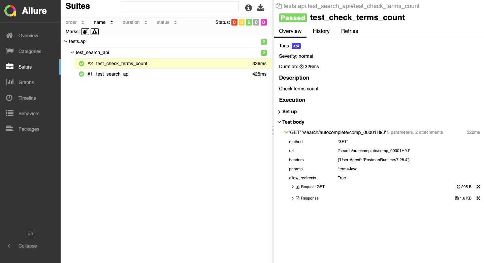

# Автотесты для Web 

*  Wiley


* Чеклист
  * API
    * ✅ Поиск в search API по ключевому слову 'Java'
    * ✅ Проверка на количество успешно найденных совпадений
  
  * Web
    * ✅ Проверка доступности раздела сайта 'Who We Serve'
    * ✅ Проверка доступности раздела сайта 'Subjects'
    * ✅ Проверка доступности раздела сайта 'The Wiley Network'
    * ✅ Проверка доступности раздела сайта 'About'

## Запуск
*  Определить системный параметр :
    - TESTS_FOLDER :
      - api/tests
      - web/tests/


### Local
```
pytest .
```

### Remote
```bash
ls -la
python -m venv venv
pip install -r requirements.txt
source .venv/bin/activate
pytest ${TESTS_FOLDER}
```

### Общий отчёт о прохождении автотестов в Allure


### Отчёты о прохождении API тестов 



### Отчёты о прохождении Web тестов 
